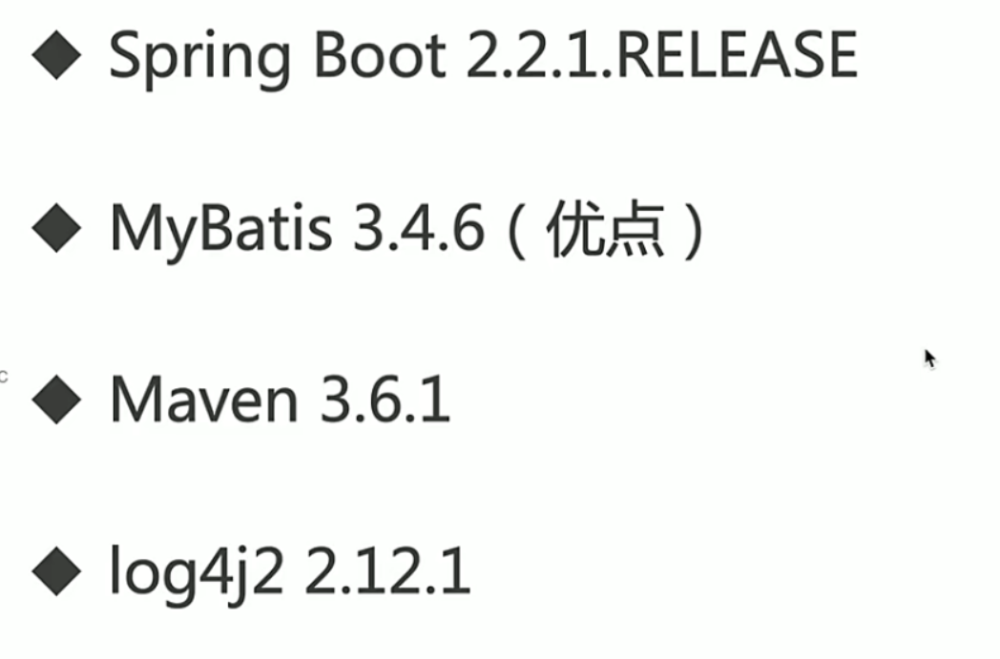
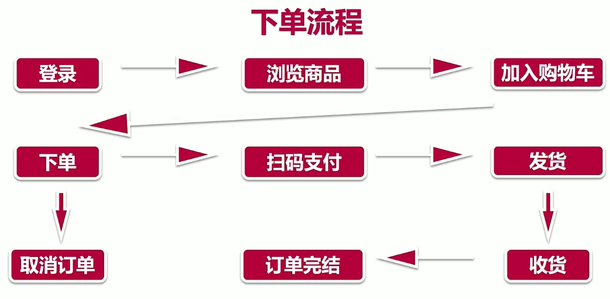

### SpringBoot的核心特点

- 开箱即用
- 预定大于配置

### SpringBoot电商项目

#### 数据库设计与项目初始化



#### log4j2日志

日志级别：**error**，warn，**info**（用户的请求和返回），**debug**（开发相关），trace。

排除和引入日志组件

```xml
<exclusions>
	<exclusion>
		<groupId>org.springframework.boot</groupId>
		<artifactId>spring-boot-starter-logging</artifactId>
	</exclusion>
</exclusions>

<dependency>
	<groupId>org.springframework.boot</groupId>
	<artifactId>spring-boot-starter-log4j2</artifactId>
</dependency>
```

编写配置文件：classpath:log4j2.xml

#### AOP统一处理Web请求日志

创建filter，打印请求信息和返回信息。

引入依赖：

```xml
<dependency>
	<groupId>org.springframework.boot</groupId>
	<artifactId>spring-boot-starter-aop</artifactId>
</dependency>
```

开发filter组件，`WebLogAspect.java`

```java
/**
 * 打印请求和相应信息
 */

@Aspect // 标记当前类为一个切面供容器读取
@Component
public class WebLogAspect {
    // 生成logger对象
    private final Logger log = LoggerFactory.getLogger(WebLogAspect.class);

    // 连接点，即定义在应用程序流程的何处插入切面的执行
    @Pointcut("execution(public * com.imooc.mall.controller.*.*(..))")
    public void webLog(){
    }

    @Before("webLog()")
    public void doBefore(JoinPoint joinPoint){
        // 收到请求记录请求信息，joinPoint记录关于类的信息，方法的信息
        // 通过RequestContextHolder对象拿到请求属性
        ServletRequestAttributes attributes = (ServletRequestAttributes) RequestContextHolder.getRequestAttributes();
        // 在属性中拿到请求信息
        assert attributes != null;
        HttpServletRequest request = attributes.getRequest();
        log.info("URL : " + request.getRequestURL().toString());
        log.info("HTTP_METHOD : " + request.getMethod());
        log.info("CLASS_METHOD : " + joinPoint.getSignature().getDeclaringTypeName() + "." + joinPoint.getSignature().getName());
        log.info("ARGS : " + Arrays.toString(joinPoint.getArgs()));
    }

    @AfterReturning(returning = "res", pointcut = "webLog()")
    public void doAfter(Object res) throws JsonProcessingException {
        // 处理完请求，返回内容
        log.info("RESPONSE : " + new ObjectMapper().writeValueAsString(res));
    }
}
```

### 用户模块

统一处理异常：将服务器内部的异常信息对外隐藏，将抛出的异常直接转化位JSON的APIResponse。

抛出重名异常处理步骤：

1. 在exception包下新建GlobalExceptionHandler类拦截controller抛出的异常

   ```java
   @ControllerAdvice
   public class GlobalExceptionHandler {
       // 获取日志对象
       private final Logger log = LoggerFactory.getLogger(GlobalExceptionHandler.class);
   
       @ExceptionHandler(Exception.class)
       @ResponseBody
       public Object handleException(Exception e){
           log.error("Default Exception : ", e);
           return ApiRestResponse.error(ImoocMailExceptionEnum.STSTEM_ERROR);
       }
   
       @ExceptionHandler({ImoocMallException.class})
       @ResponseBody
       public Object handleImoocMallException(ImoocMallException e){
           return ApiRestResponse.error(e.getCode(), e.getMessage());
       }
   ```

因为需要将异常响应返回给前端，因此需要加上`@ResponseBody`注解。

#### Java异常体系


#### 用户密码加密

在util包下新建一个MD5Utils类和common包下新建一个constant常数类：

```java
public class MD5Utils {
    public static String getMd5String(String strValue) throws NoSuchAlgorithmException {
        MessageDigest md5 = MessageDigest.getInstance("MD5");
        return Base64.encodeBase64String(md5.digest((strValue + Constant.SALT).getBytes()));
    }
}
```

```java
/**
 * 常量值
 */
public class Constant {
    public static final String SALT = "dcjsioafhseikfhlsifvds";
}
```

加密后的密码存数据库。

#### 登录功能分析

需要保持登录状态（HTTP是无状态请求协议），使用session，登录后，会保存用户信息到session。

之后的访问，会先从session中获取用户信息，然后再执行业务逻辑。

```java
/**
     * 用户登录
     * @param userName
     * @param password
     * @param session
     * @return
     * @throws ImoocMallException
     */
    @PostMapping("/login")
    @ResponseBody
    public ApiRestResponse login(@RequestParam("userName") String userName, @RequestParam("password") String password, HttpSession session) throws ImoocMallException {
        if(StringUtils.isEmpty(userName)){
            return ApiRestResponse.error(ImoocMailExceptionEnum.Need_User_Name);
        }
        if(StringUtils.isEmpty(password)){
            return ApiRestResponse.error(ImoocMailExceptionEnum.Need_PASSWORD);
        }
        User user = userService.login(userName, password);
        // 保存用户信息时不保存密码
        user.setPassword(null);
        session.setAttribute(Constant.IMOOC_MALL_USER, user);
        return ApiRestResponse.success(user);
    }
```

登出就通过请求session中的`Constant.IMOOC_MALL_USER`属性

```java
    /**
     * 用户注销 清除session
     * @param session
     * @return
     */
    @PostMapping("/user/logout")
    @ResponseBody
    public ApiRestResponse logout(HttpSession session){
        session.removeAttribute(Constant.IMOOC_MALL_USER);
        return ApiRestResponse.success();
    }
```

### 商品分类管理模块

对前端传回的订单对象进行参数校验可以使用以下注解：

@Valid(需要验证), @NotNull(不为空), @Max(value), @Size(max, min)字符串长度范围限制.

#### Swagger自动生成文档

1. 引入依赖:

   ```xml
   <!--        swagger自动文档生成-->
           <dependency>
               <groupId>io.springfox</groupId>
               <artifactId>springfox-swagger2</artifactId>
               <version>2.9.2</version>
           </dependency>
           <dependency>
               <groupId>io.springfox</groupId>
               <artifactId>springfox-swagger-ui</artifactId>
               <version>2.9.2</version>
           </dependency>
   ```

2. 主程序入口加上注解`@EnableSwagger2`

3. 编写配置类`SpringFoxConfig.java`和`ImoocMallMvcConfig.java`

   ```java
   @Configuration
   public class ImoocMallMvcConfig implements WebMvcConfigurer {
       @Override
       public void addResourceHandlers(ResourceHandlerRegistry registry) {
           registry.addResourceHandler("swagger-ui.html").addResourceLocations("classpath:/META-INF/resources/");
           registry.addResourceHandler("/webjars/**").addResourceLocations("classpath:/META-INF/resources/webjars/");
       }
   }
   ```

4. 配置MvcConfig类

   ```java
   @Configuration
   public class SpringFoxConfig {
   
       //访问http://localhost:8089/swagger-ui.html可以看到API文档
       @Bean
       public Docket api() {
           return new Docket(DocumentationType.SWAGGER_2)
                   .apiInfo(apiInfo())
                   .select()
                   .apis(RequestHandlerSelectors.any())
                   .paths(PathSelectors.any())
                   .build();
       }
   
       private ApiInfo apiInfo() {
           return new ApiInfoBuilder()
                   .title("慕慕生鲜")
                   .description("")
                   .termsOfServiceUrl("")
                   .build();
       }
   }
   ```

   访问接口时需要加上http前缀, 不然找不到页面.

#### 对重复的代码进行复用操作(避免冗余 )

以校验当前用户是否是管理员为例:

校验的模板代码：

```java
User currentUser = (User) session.getAttribute(Constant.IMOOC_MALL_USER);
        // 当前用户是否登录
        if(currentUser == null){
            return ApiRestResponse.error(ImoocMailExceptionEnum.NEED_LOGIN);
        }
        boolean isAdmin = userService.checkAdminRole(currentUser);
        // 校验是否是管理员
        if(isAdmin){ // 更新目录
            Category category = new Category();
            BeanUtils.copyProperties(updateCategoryReq, category);
            categoryService.update(category);
            return ApiRestResponse.success();
        } else {
            return ApiRestResponse.error(ImoocMailExceptionEnum.NEED_ADMIN);
        }
```

对上述代码进行抽取：

在filter里新建AdminFilter类实现Filter类，重写init，doFilter和destory方法：

```java
public class AdminFilter implements Filter {
    @Autowired
    private UserService userService;
    @Override
    public void init(FilterConfig filterConfig) throws ServletException {
        Filter.super.init(filterConfig);
    }

    @Override
    public void doFilter(ServletRequest servletRequest, ServletResponse servletResponse, FilterChain filterChain) throws IOException, ServletException {
        //将servletRequest对象转换为HttpServletRequest对象
        HttpServletRequest request = (HttpServletRequest) servletRequest;
        // 拿到session
        HttpSession session = request.getSession();
        // 在session中找登录用户对象
        User currentUser = (User) session.getAttribute(Constant.IMOOC_MALL_USER);
        // 当前用户是否登录
        if(currentUser == null){
            // 错误信息通过PrintWriter进行写入和输出，在HttpServletResponse中拿到Writer对象
            PrintWriter out = new HttpServletResponseWrapper((HttpServletResponse) servletResponse).getWriter();
            out.write("{\n" +
                    "    \"status\": 10007,\n" +
                    "    \"msg\": \"NEED_LOGIN\",\n" +
                    "    \"data\": null\n" +
                    "}");
            out.flush();
            out.close();
            return;
        }
        boolean isAdmin = userService.checkAdminRole(currentUser);
        // 校验是否是管理员
        if(isAdmin){ // 放行
            filterChain.doFilter(servletRequest, servletResponse);
        } else { // 报错没有管理员权限
            PrintWriter out = new HttpServletResponseWrapper((HttpServletResponse) servletResponse).getWriter();
            out.write("{\n" +
                    "    \"status\": 10009,\n" +
                    "    \"msg\": \"NEED_ADMIN\",\n" +
                    "    \"data\": null\n" +
                    "}");
            out.flush();
            out.close();
        }
    }

    @Override
    public void destroy() {
        Filter.super.destroy();
    }
}
```

配置adminFilter，新建adminFilterConfig类：

```java
@Configuration
public class AdminFilterConfig {
    // 构造方法来注入AdminFiltr对象
    @Bean
    public AdminFilter adminFilter(){
        return new AdminFilter();
    }

    // 构造方法来注入adminFilterConfig对象
    @Bean(name = "adminFilterConf")
    public FilterRegistrationBean adminFilterConfig(){
        FilterRegistrationBean filterRegistrationBean = new FilterRegistrationBean();
        filterRegistrationBean.setFilter(adminFilter());
        filterRegistrationBean.addUrlPatterns("/admin/category/*");
        filterRegistrationBean.addUrlPatterns("/admin/product/*");
        filterRegistrationBean.addUrlPatterns("/admin/order/*");
        filterRegistrationBean.setName("adminFilterConfig");
        return filterRegistrationBean;
    }
}
```

在Controller类中的使用：

加上PostMapping注解对应的映射地址后，会自动拦截进行校验：

```java
    @PostMapping("/admin/category/delete")
    @ApiOperation("后台删除分类")
    public ApiRestResponse deleteCategory(){
        return ApiRestResponse.success();
    }
```

#### 后台分页查询

1. 引入pageHelper依赖；

   ```xml
   <dependency>
               <groupId>com.github.pagehelper</groupId>
               <artifactId>pagehelper-spring-boot-starter</artifactId>
               <version>1.2.13</version>
           </dependency>
   ```

2. mapper类加入查询list的方法

   ```xml
     <select id="selectList" resultMap="BaseResultMap">
       select <include refid="Base_Column_List"></include>
       from imooc_mall_category
     </select>
   ```

3. CategoryImpl实现类：

   ```java
       // 后台分页
       @Override
       public PageInfo listForAdmin(Integer pageNum, Integer pageSize){
           // 先按照type进行排序, 相同type按照order_num进行排序
           PageHelper.startPage(pageNum, pageSize, "type, order_num");
           List<Category> categoryList = categoryMapper.selectList();
           return new PageInfo(categoryList);
       }
   ```

#### 前台分页 - 递归嵌套和redis缓存

递归查询，对前台地需要包裹parentID的子列表，新建一个CategoryVO实体类 包装返回对象

1. 新建vo实体类 - CategoryVo

   ```java
   public class CategoryVO {
       private Integer id;
       private String name;
       private Integer type;
       private Integer parentId;
       private Integer orderNum;
       private Date createTime;
       private Date updateTime;
       private List<CategoryVO> childCategory = new ArrayList<>();
       public List<CategoryVO> getChildCategory() {
           return childCategory;
       }
       // getter and setter
   }
   ```

1. 在实现类中写递归查询的方法，

   ```java
       // 前台分页
       @Override
       public List<CategoryVO> listCategoryForCustomer(){
           ArrayList<CategoryVO> categoryVOList = new ArrayList<>();
           // 从parentId为0开始查起
           recursivelyFindCategories(categoryVOList, 0);
           return categoryVOList;
       }
   
       // 递归查找子类别, 组合成一个目录树
       private void recursivelyFindCategories(List<CategoryVO> categoryVOList, Integer parentId){
           List<Category> categoryList = categoryMapper.selectCategoriesByParentId(parentId);
           if(!CollectionUtils.isEmpty(categoryList)){ // 不为空
               for(Category category : categoryList){
                   CategoryVO categoryVO = new CategoryVO();
                   // 初始的childCategory为空
                   BeanUtils.copyProperties(category, categoryVO);
                   categoryVOList.add(categoryVO);
                   // 递归地添加
                   // 往childCategory里添加列表完成递归操作
                   recursivelyFindCategories(categoryVO.getChildCategory(), categoryVO.getId());
               }
           }
       }
   ```

1. 利用redis缓存加速响应，

   - pom文件引入依赖

     ```xml
     <!--        redis缓存-->
             <dependency>
                 <groupId>org.springframework.boot</groupId>
                 <artifactId>spring-boot-starter-data-redis</artifactId>
             </dependency>
             <dependency>
                 <groupId>org.springframework.boot</groupId>
                 <artifactId>spring-boot-starter-cache</artifactId>
             </dependency>
     ```

   - 配置文件配置redis - 访问地址，端口，密码：

     ```properties
     spring.redis.host=localhost
     spring.redis.port=6379
     spring.redis.password=
     ```

   - 启动类加上redis相关的配置 - CachingConfig

     ```java
     @EnableCaching
     public class MailApplication {
         public static void main(String[] args) {
             SpringApplication.run(MailApplication.class, args);
         }
     }
     ```

   - 对希望进行缓存的方法加上相关注解  - `@Cacheable(value = "listCategoryForCustomer") // 用value指定key值`

     ```java
     // 接口实现类
         // 前台分页
         @Override
         @Cacheable(value = "listCategoryForCustomer") // 用value指定key值
         public List<CategoryVO> listCategoryForCustomer(){
             ArrayList<CategoryVO> categoryVOList = new ArrayList<>();
             recursivelyFindCategories(categoryVOList, 0);
             return categoryVOList;
         }
     ```

   - 配置redis - CachingConfig

     ```java
     /**
      * 缓存的配置类
      */
     @Configuration
     @EnableCaching
     public class CachingConfig {
         // 构造方法注入bean
         @Bean
         public RedisCacheManager redisCacheManager(RedisConnectionFactory connectionFactory){
             RedisCacheWriter redisCacheWriter = RedisCacheWriter.lockingRedisCacheWriter(connectionFactory);
             RedisCacheConfiguration cacheConfiguration = RedisCacheConfiguration.defaultCacheConfig();
             // 超时时间
             cacheConfiguration = cacheConfiguration.entryTtl(Duration.ofSeconds(30));
             return new RedisCacheManager(redisCacheWriter, cacheConfiguration);
         }
     }
     ```

#### 商品分类模块总结


常见错误：手动参数校验，项目不用缓存。

### 商品模块

#### 图片上传

UUID文件名（通用统一识别码）防止重名和爬图。

生成规则：日期和时间，MAC地址，HashCode和随机数

- 通过`MultipartFile`在service编写接口生成新的文件名:

  ```java
    /**
       * 根据传入的file得包含uuid的新的文件名
       * @param file
       * @return
       */
      @Override
      public String getNewFileName(MultipartFile file){
          String fileName = file.getOriginalFilename();
          String suffixName = fileName.substring(fileName.lastIndexOf("."));
          UUID uuid = UUID.randomUUID();
          return uuid.toString() + suffixName;
      }
  ```

- 在常量类自定义上传目录地址:

  ```java
      public static String FILE_UPLOAD_DIR;
      @Value("${file.upload.dir}")
      public void setFileUploadDir(String fileUploadDir){
          FILE_UPLOAD_DIR = fileUploadDir;
      }
  ```

  可以直接在配置文件用`file.upload.dir`指定上传目录

- 在控制类中生成上传文件

  ```java
      @ApiOperation("图片上传")
      @PostMapping("/admin/upload/file")
      public ApiRestResponse upload(HttpServletRequest request, @RequestParam("file") MultipartFile file){
          String newFileName = productService.getNewFileName(file);
          // 文件夹
          File fileDir = new File(Constant.FILE_UPLOAD_DIR);
          // 文件
          File destFile = new File(Constant.FILE_UPLOAD_DIR + newFileName);
          if(!fileDir.exists()){ // 文件夹不存在
              if(!fileDir.mkdir()){ // 创建文件夹失败
                  throw new ImoocMallException(ImoocMailExceptionEnum.MKDIR_FAILED);
              }
          }
          try {
              // 通过transferTo写入文件
              file.transferTo(destFile);
          } catch (IOException e) {
              e.printStackTrace();
              throw new ImoocMallException(ImoocMailExceptionEnum.UPLOAD_FAILED);
          }
          try {
              // 生成的data包含新的图像对应服务器的地址
              return ApiRestResponse.success(getHost(new URI(request.getRequestURL() +"")) + "/images/" + newFileName);
          } catch (URISyntaxException e) {
              e.printStackTrace();
              throw new ImoocMallException(ImoocMailExceptionEnum.UPLOAD_FAILED);
          }
      }
  
      private URI getHost(URI uri){
          URI effectiveURI;
          try {
              // 裁剪URI
              effectiveURI = new URI(uri.getScheme(), uri.getUserInfo(), uri.getHost(), uri.getPort(), null, null, null);
          } catch (URISyntaxException e) {
              e.printStackTrace();
              effectiveURI = null;
          }
          return effectiveURI;
      }
  ```

#### 自定义静态资源映射目录（上传完图片后回显）

  在生成完图像地址后不能通过浏览器直接访问, 需要在MvcConfig中添加配置地址映射:

  ```java
  /**
   * 配置地址映射
   */
  @Configuration
  public class ImoocMallMvcConfig implements WebMvcConfigurer {
      @Override
      public void addResourceHandlers(ResourceHandlerRegistry registry) {
          registry.addResourceHandler("swagger-ui.html").addResourceLocations("classpath:/META-INF/resources/");
          registry.addResourceHandler("/webjars/**").addResourceLocations("classpath:/META-INF/resources/webjars/");
          registry.addResourceHandler("/images/**").addResourceLocations("file:" + Constant.FILE_UPLOAD_DIR);
      }
  }
  ```

  这里的`addResourceLocations`中file对应的是`file:///dir`.

#### 批量上下架

mybatis遍历list和拼接where语句:

在ProductMapper中定义`batchUpdateSellStatus`方法, 传入ids数组和上下架状态:

```java
int batchUpdateSellStatus(@Param("ids") Integer[] ids, @Param("sellStatus") Integer sellStatus);
```

在对应的xml文件中编写sql语句:

```xml
  <update id="batchUpdateSellStatus">
    update imooc_mall_product
    set status = #{sellStatus}
    where id in
    <foreach collection="ids" close=")" item="id" open="(" separator=",">
      #{id}
    </foreach>
  </update>
```

```sql
update imooc_mall_product
SET `status` = 1
WHERE id IN (2, 3)
```

#### 前台商品列表

搜索功能:

入参判空 -> 加%通配符 -> like关键字实现查找功能


首先看前端传过来的参数: 


对请求参数新建一个`ProductListReq`来接收参数. 包含关键字的模糊查询可以使用%keyword%对条件语句进行拼接, 使用like进行查询.

查询的参数包含categoryId, 需要将以该id为parentId下所有商品都进查出来, 构建Query对象:

```java
public class ProductListQuery {
    private String keyword;
    // 存放属于该分类级别下的所有id
    private List<Integer> categoryIds;
}
```

具体实现方法:

```java
    // 前台展示商品列表
    @Override
    public PageInfo list(ProductListReq productListReq){
        // 构建query对象
        ProductListQuery productListQuery = new ProductListQuery();
        // 搜索处理 - keyword不为空
        if(!StringUtils.isEmpty(productListReq.getKeyword())){
            // 凭借查询语句
            String keyword = new StringBuilder().append("%").append(productListReq.getKeyword()).append("%").toString();
            // 封装query对象
            productListQuery.setKeyword(keyword);
        }

        // 目录处理,如果查某个目录下的商品,不仅需要查询该目录下的,还要把所有子目录的所有商品都查出来,所以需要拿到一个目录id的list
        if(productListReq.getCategoryId() != null){
            // 含有子目录
            List<CategoryVO> categoryVOS = categoryService.listCategoryForCustomer(productListReq.getCategoryId());
            List<Integer> categoryIds = new ArrayList<>();
            categoryIds.add(productListReq.getCategoryId());
            // 递归查询子目录
            getCategoryIds(categoryVOS, categoryIds);
            // 设置查询对象
            productListQuery.setCategoryIds(categoryIds);
        }

        // 排序处理
        String orderBy = productListReq.getOrderBy();
        // 使用常量接口判断排序方式
        if(Constant.ProductListOrderBy.PRICE_ASC_DESC.contains(orderBy)){
            PageHelper.startPage(productListReq.getPageNum(), productListReq.getPageSize(), orderBy);
        } else {
            PageHelper.startPage(productListReq.getPageNum(), productListReq.getPageSize());
        }

        List<Product> productList = productMapper.selectList(productListQuery);
        return new PageInfo(productList);
    }

    private void getCategoryIds(List<CategoryVO> categoryVOS, List<Integer> categoryIds){
        for(CategoryVO categoryVO : categoryVOS){
            if(categoryVO != null){
                categoryIds.add(categoryVO.getId());
                // 递归地添加
                getCategoryIds(categoryVO.getChildCategory(), categoryIds);
            }
        }
    }
```

常量接口:

```java
public interface ProductListOrderBy{
        HashSet<String> PRICE_ASC_DESC = Sets.newHashSet("price desc", "price asc");
    }
```

mapper接口:

```java
List<Product> selectList(@Param("query")ProductListQuery productListQuery);
```

sql查询语句

```xml
  <select id="selectList" resultMap="BaseResultMap" parameterType="com.imooc.mall.model.query.ProductListQuery">
    select
    <include refid="Base_Column_List"></include>
    from imooc_mall_product
    <where>
      <if test="query.keyword != null">
        and name like #{query.keyword}
      </if>
      <if test="query.categoryIds != null">
        and category_id in
        <foreach collection="query.categoryIds" close=")" item="item" separator="," open="(">
          #{item}
        </foreach>
      </if>
        and status = 1
    </where>
  </select>
```

#### 商品模块总结

- 重难点: 商品的搜索, 排序和目录的查询(递归的方式查所有id)
- 排序字段使用枚举(防止sql注入)

### 购物车模块


#### 用户过滤器

用来校验用户是否登录, UserFilter实现Filter接口:

```java
/**
 * 用户校验过滤器
 */
public class UserFilter implements Filter {
    // 暂存用户信息 可能存在多线程安全问题
    private static User currentUser;
    @Autowired
    private UserService userService;
    @Override
    public void init(FilterConfig filterConfig) throws ServletException {
        Filter.super.init(filterConfig);
    }

    @Override
    public void doFilter(ServletRequest servletRequest, ServletResponse servletResponse, FilterChain filterChain) throws IOException, ServletException {
        HttpServletRequest request = (HttpServletRequest) servletRequest;
        HttpSession session = request.getSession();
        currentUser = (User) session.getAttribute(Constant.IMOOC_MALL_USER);
        // 当前用户是否登录
        if(currentUser == null){
            PrintWriter out = new HttpServletResponseWrapper((HttpServletResponse) servletResponse).getWriter();
            out.write("{\n" +
                    "    \"status\": 10007,\n" +
                    "    \"msg\": \"NEED_LOGIN\",\n" +
                    "    \"data\": null\n" +
                    "}");
            out.flush();
            out.close();
            return;
        }
        filterChain.doFilter(servletRequest, servletResponse);
    }

    @Override
    public void destroy() {
        Filter.super.destroy();
    }
}
```

配置拦截路径新建`UserFilterConfig`类:

```java
@Configuration
public class UserFilterConfig {
    @Bean
    public UserFilter userFilter(){
        return new UserFilter();
    }

    @Bean(name = "userFilterConf")
    public FilterRegistrationBean adminFilterConfig(){
        FilterRegistrationBean filterRegistrationBean = new FilterRegistrationBean();
        filterRegistrationBean.setFilter(userFilter());
        filterRegistrationBean.addUrlPatterns("/cart/*");
        filterRegistrationBean.addUrlPatterns("/order/*");
        filterRegistrationBean.setName("userFilterConfig");
        return filterRegistrationBean;
    }
}
```

#### 购物车和购物车列表开发

首先看购物车的表设计:


在前端展示的时候还包括商品描述, 名称和总价的信息. 因此需要封装实体类, 再返回给前端.

CartVO实体类:

```java
/**
 * 前端展示用
 */
public class CartVO {
    private Integer id;
    private Integer productId;
    private Integer userId;
    private Integer quantity;
    private Integer selected;
    private Integer price;
    private Integer totalPrice;
    private String productName;
    private String productImage;
    // getter and setter
}
```

CartService实现类中通过UserFilter拿到当前用户id, 根据当前用户id来查询包含CartVO对象的集合:

```java
   @Override
    public List<CartVO> list(Integer userId){
        // 查询当前用户的购物车
        List<CartVO> cartVOS = cartMapper.selectList(userId);
        for(CartVO cartVO : cartVOS){
            cartVO.setTotalPrice(cartVO.getPrice() * cartVO.getQuantity());
        }
        return cartVOS;
    }
```

```xml
 <select id="selectList" parameterType="int" resultType="com.imooc.mall.model.vo.CartVO">
     <!-- 对应CartVO的字段 -->
    select
        c.id as id,
        p.id as productId,
        c.user_id as userId,
        c.quantity as quantity,
        c.selected as selected,
        p.price as price,
        p.name as productName,
        p.image as productImage
    from imooc_mall_cart c
    left join imooc_mall_product p on p.id = c.product_id
    where c.user_id = #{userId}
    and p.status = 1
  </select>
```

控制类在Filter拿到当前用户id

```java
 @ApiOperation("购物车列表")
    @GetMapping("/list")
    public ApiRestResponse list(){
        // 内部获取用户id 防止横向越权
        List<CartVO> cartList = cartService.list(UserFilter.currentUser.getId());
        return ApiRestResponse.success(cartList);
    }
```

添加商品的实现: 

```java
 @Override
    public List<CartVO> add(Integer userId, Integer productId, Integer count){
        validProduct(productId, count);
        Cart cart = cartMapper.selectCartByUserIdAndProductId(userId, productId);
        if(cart == null){
            // 商品不在购物车里, 需要新增记录
            cart = new Cart();
            cart.setProductId(productId);
            cart.setUserId(userId);
            cart.setQuantity(count);
            cart.setSelected(Constant.Cart.CHECKED);
            cartMapper.insertSelective(cart);
        } else { // 商品已经在购物车里数量相加
            count += cart.getQuantity();
            Cart newCart = new Cart();
            newCart.setQuantity(count);
            newCart.setId(cart.getId());
            newCart.setUserId(cart.getUserId());
            newCart.setProductId(cart.getProductId());
            newCart.setSelected(Constant.Cart.CHECKED);
            cartMapper.updateByPrimaryKeySelective(newCart);
        }
        // 返回的也是购物车集合
        return this.list(userId);
    }
// 验证参数是否合法
    private void validProduct(Integer productId, Integer count) {
        Product product = productMapper.selectByPrimaryKey(productId);
        // 判断商品是否存在和上架
        if(product == null || product.getStatus().equals(Constant.SaleStatus.NOT_SALE)){
            throw new ImoocMallException(ImoocMailExceptionEnum.NOT_SALE);
        }
        // 判断商品库存
        if(count > product.getStock()){
            throw new ImoocMallException(ImoocMailExceptionEnum.NOT_ENOUGH);
        }
    }
```

##### 补充 left right inner join

left join 包含左表的所有字段数据, 右表没有则为null, rightjoin 相反, inner join寻找两表共有的字段.

#### 商品的选中与全选

主要是对cart表的中对应商品的status进行更新, 当不传入product时则对购物车所有的商品进行操作

service实现类:

```java
 // 选中和取消选择
    @Override
    public List<CartVO> selectOrNot(Integer userId, Integer productId, Integer selected){
        Cart cart = cartMapper.selectCartByUserIdAndProductId(userId, productId);
        if(cart == null) {
            throw new ImoocMallException(ImoocMailExceptionEnum.UPDATE_FAILED);
        }else {
            cartMapper.selectOrNot(userId, productId, selected);
        }
        return this.list(userId);
    }

    // 全选或全不选
    @Override
    public List<CartVO> selectAllOrNot(Integer userId, Integer selected){
        // 改变选中状态
        cartMapper.selectOrNot(userId, null, selected);
        return this.list(userId);
    }
```

xml实现的sql语句

```xml
  <update id="selectOrNot" parameterType="map">
    update imooc_mall_cart
    set selected = #{selected}
    where user_id = #{userId}
      <!-- 不传入则更新所有商品 -->
      <if test="productId != null">
        and product_id = #{productId}
      </if>
  </update>
```

#### 购物车模块总结

- Mybatis返回非标准对象, 需要考虑多表查询
- 添加商品到购物车时,根据是否已经存在该商品, 有更新count, 没有新建一个购物车

### 订单模块



#### 生成订单 - 用户下单

入参 - 只用传收件人信息, 从购物车中查找已经勾选的商品, 判断商品是否在售卖中.

 判断库存, 保证不超卖, 扣库存.

数据库使用事务保证订单的正确生成.

订单生成的过程中, 首先删除购物车中对应的商品, 生成包含相关商品的订单. 此外还包含订单号生成的规则.

#### 创建订单

涉及到四个表之间的操作（订单表，订单商品表，购物车表和商品表）

首先对前端传入的请求体进行包装，生成order中的部分字段（receiverName，receiverMobile和receiverAddress）

```java
// CreateOrderReq.java
public class CreateOrderReq {
    @NotNull(message = "收件人姓名不能为空")
    private String receiverName;
    @NotNull(message = "收件人电话不能为空")
    private String receiverMobile;
    @NotNull(message = "收件人地址不能为空")
    private String receiverAddress;
    private Integer postage = 0;
    private Integer paymentType = 1;
}
```

具体业务逻辑在OrderServiceImpl类：

首选需要拿到当前用户id:

```java
// 拿到用户id
Integer userId = UserFilter.currentUser.getId();
```

前端只传了收件人信息，需要通过用户id拿到购物车里的商品（CartVO不仅包含了Cart对象属性，还封装了商品单价和总价，商品描述和图片信息）：

```java
// 从购物车查找已经勾选的商品
List<CartVO> cartVOList = cartService.list(userId);
List<CartVO> cartVOListTemp = new ArrayList<>();
for(CartVO cartVO : cartVOList){
    if(cartVO.getSelected().equals(Constant.Cart.CHECKED)){
        cartVOListTemp.add(cartVO);
    }
}
```

校验购物车是否为空：

```java
// 如果购物车已勾选的为空 则报错
if(CollectionUtils.isEmpty(cartVOList)){
    throw new ImoocMallException(ImoocMailExceptionEnum.CART_EMPTY);
}     
```

判断商品是否存在，上下架状态和库存：

```java
validSaleStatusAndStock(cartVOList);
    private void validSaleStatusAndStock(List<CartVO> cartVOList) {
        for (CartVO cartVO: cartVOList){
            Product product = productMapper.selectByPrimaryKey(cartVO.getProductId());
            // 商品是否上架
            if(product == null || product.getStatus().equals(Constant.SaleStatus.NOT_SALE)){
                throw new ImoocMallException(ImoocMailExceptionEnum.NOT_SALE);
            }
            // 判断商品库存
            if(product.getStock() < cartVO.getQuantity()){
                throw new ImoocMallException(ImoocMailExceptionEnum.NOT_ENOUGH);
            }
        }
    }
```

把购物车对象转换为订单item对象，首先遍历CartVOList，完成相应属性的赋值

```java
// 把购物车对象转换为订单item对象
List<OrderItem> orderItemList = cartVOListToOrderItemList(cartVOList);
private List<OrderItem> cartVOListToOrderItemList(List<CartVO> cartVOList) {
        List<OrderItem> orderItemList = new ArrayList<>();
        for(CartVO cartVO : cartVOList){
            OrderItem orderItem = new OrderItem();
            orderItem.setProductId(cartVO.getProductId());
            orderItem.setQuantity(cartVO.getQuantity());
            // 记录商品快照信息
            orderItem.setProductName(cartVO.getProductName());
            orderItem.setProductImg(cartVO.getProductImage());
            orderItem.setUnitPrice(cartVO.getPrice());
            orderItem.setTotalPrice(cartVO.getTotalPrice());
            orderItemList.add(orderItem);
        }
        return orderItemList;
    }
```

添加相应的商品到订单后，需要更新商品库存，涉及到商品表的更新操作

```java
// 扣库存
        for (OrderItem orderItem: orderItemList) {
            Product product = productMapper.selectByPrimaryKey(orderItem.getProductId());
            int stock = product.getStock() - orderItem.getQuantity();
            if(stock < 0){
                throw new ImoocMallException(ImoocMailExceptionEnum.NOT_ENOUGH);
            }
            product.setStock(stock);
            // 更新
            productMapper.updateByPrimaryKeySelective(product);
        }
```

然后是把购物车中对应的商品删除，购物车表的删除操作：

```java
cleanCart(cartVOList);
private void cleanCart(List<CartVO> cartVOList) {
        for(CartVO cartVO : cartVOList){
            cartMapper.deleteByPrimaryKey(cartVO.getId());
        }
    }
```

生成订单号 工具类随机生成订单号，生成订单对象，完成对象属性的赋值，将order对象插入到order_item表中， 将order插入到order表中：

```java
// 生成订单号
        Order order = new Order();
        String orderNo = OrderCodeFactory.getOrderCode(Long.valueOf(userId));
        order.setOrderNo(orderNo);
        order.setUserId(userId);
        order.setTotalPrice(totalPrice(orderItemList));
        order.setReceiverName(createOrderReq.getReceiverName());
        order.setReceiverAddress(createOrderReq.getReceiverAddress());
        order.setReceiverMobile(createOrderReq.getReceiverMobile());
        order.setOrderStatus(Constant.OrderStatusEnum.NOT_PAY.getCode());
        order.setPostage(0);
        order.setPaymentType(1);
        // 插入到order表中
        orderMapper.insertSelective(order);
```

orderItem表插入，最后返回订单号：

```java
for(OrderItem orderItem : orderItemList){
            orderItem.setOrderNo(orderNo);
            orderItemMapper.insertSelective(orderItem);
        }
        return orderNo;
```

#### 添加数据库事务

由于新增订单的涉及到多表的操作，如果数据库操作出错，应该使用事务来完成回滚操作：

 在serviceImpl方法上加上注解, 可以通过人为抛出异常来进行测试。

```java
@Transactional(propagation = Propagation.REQUIRED, rollbackFor = Exception.class)
```

#### 订单详情

涉及到订单表和订单商品表的查询操作：首先根据前端接口要求的返回的数据封装返回对象：


相比order还多了orderItemVOList对象和状态名：

封装这两个对象：

```java
public class OrderItemVO {
    private String orderNo;
    private Integer productId;
    private String productName;
    private String productImg;
    private Integer unitPrice;
    private Integer quantity;
    private Integer totalPrice;
}
```

```java
public class OrderVO {
    private String orderNo;
    private Integer userId;
    private Integer totalPrice;
    private String receiverName;
    private String receiverMobile;
    private String receiverAddress;
    private Integer orderStatus;
 	private Integer postage;
    private Integer paymentType;
    private Date deliveryTime;
    private Date payTime;
    private Date endTime;
    private Date createTime;
    private Date updateTime;
    private String orderStatusName;
    private List<OrderItemVO> orderItemVOList;
}
```

实现方法：

```java
 @Override
    public OrderVO detail(String orderNo){
        Order order = orderMapper.selectByOrderNo(orderNo);
        if(order == null){
            throw new ImoocMallException(ImoocMailExceptionEnum.NO_ORDER);
        }
        // 订单存在, 判断用户是否一致
        if(order.getUserId() != UserFilter.currentUser.getId()){
            throw new ImoocMallException(ImoocMailExceptionEnum.NOT_YOUR_ORDER);
        }
        return getOrderVo(order);
    }

    private OrderVO getOrderVo(Order order) {
        OrderVO orderVO = new OrderVO();
        BeanUtils.copyProperties(order, orderVO);
        // 获取订单对应的orderItemList
        List<OrderItem> orderItems = orderItemMapper.selectByOrderNo(order.getOrderNo());
        List<OrderItemVO> orderItemVOList = new ArrayList<>();
        for(OrderItem orderItem : orderItems){
            OrderItemVO orderItemVO = new OrderItemVO();
            BeanUtils.copyProperties(orderItem, orderItemVO);
            orderItemVOList.add(orderItemVO);
        }
        orderVO.setOrderItemVOList(orderItemVOList);
// 在常量枚举类根据code拿到对应的中文状态说明        
  orderVO.setOrderStatusName(Constant.OrderStatusEnum.codeOf(order.getOrderStatus()).getValue());
        return orderVO;
    }
```

#### 生成支付二维码

1. 引入依赖

   ```xml
   <dependency>
               <groupId>com.google.zxing</groupId>
               <artifactId>javase</artifactId>
               <version>3.3.0</version>
           </dependency>
   ```

2. 编写工具类：

   ```java
   public class QRCodeGenerator {
       public static void generatorQRCodeImage(String text, int width, int height, String filePath) throws WriterException, IOException {
           QRCodeWriter qrCodeWriter = new QRCodeWriter();
           BitMatrix bitMatrix = qrCodeWriter.encode(text, BarcodeFormat.QR_CODE, width, height);
           Path path = FileSystems.getDefault().getPath(filePath);
           MatrixToImageWriter.writeToPath(bitMatrix, "PNG", path);
       }
   }
   ```

3. 后端实现类：

   ```java
       @Value("${file.upload.ip}") // ip地址写到配置文件里，从请求中拿到的ip不一定是服务器的ip
       String ip;  
   /**
        * 生成支付二维码
        * @param orderNo
        * @return
        */
       @Override
       public String qrcode(String orderNo){
           // 获得端口号
           ServletRequestAttributes attributes = (ServletRequestAttributes) RequestContextHolder.getRequestAttributes();
           HttpServletRequest request = attributes.getRequest();
           String addr = ip + ":" + request.getLocalPort();
           // 这里要与支付调用的接口一致
           String payUrl = "http://" + addr + "/pay?orderNo=" + orderNo;
           try {
               QRCodeGenerator.generatorQRCodeImage(payUrl, 350, 350, Constant.FILE_UPLOAD_DIR + orderNo + ".png");
           } catch (Exception e) {
               e.printStackTrace();
               throw new ImoocMallException(ImoocMailExceptionEnum.GENERATE_QRCODE_FAILED);
           }
           // ImoocMallMvcConfig 对应的过滤器一致
           String pngAddr = "http://" + addr + "/images/" + orderNo + ".png";
           return pngAddr;
       }
   ```

#### 支付接口开发


#### 总结

重难点：

- VO的封装，裁剪
- 一个订单包含多个商品
- 订单状态的流转
- 二维码生成

不能注解把POJO返回给前端。

### 部署上线

```shell
nohub java -jar -D server.port=8081 -D spring.profiles.active=prod /root/mall-0.0.1-SNAPSHOT.jar > /root/null 2>&1&
```

nohub：不输出到前台， 运行命令后不需要长期驻守在终端。

java -jar 启动java jar包

-D 指定端口和启用的配置文件

`> /root/null 2>&1&`将错误日志输出丢弃